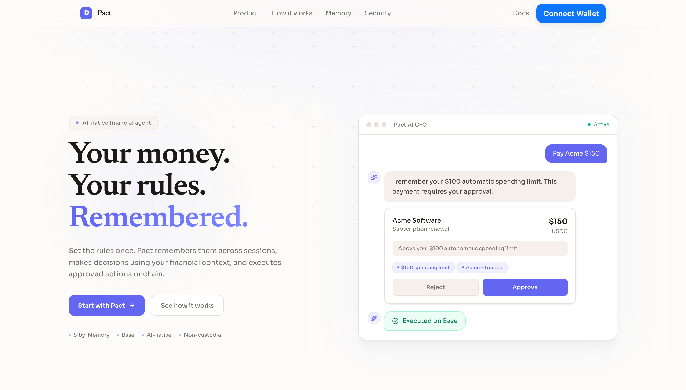
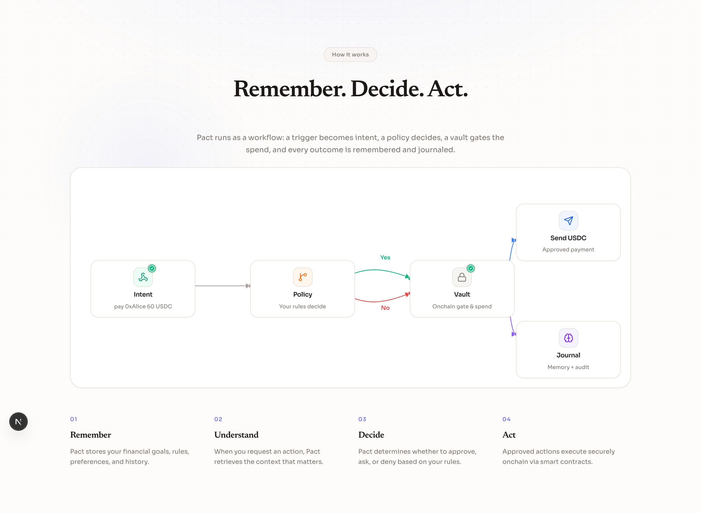
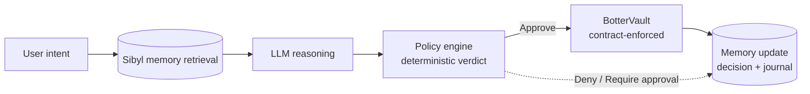
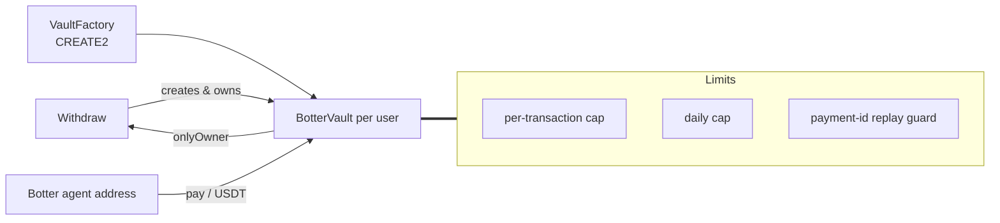
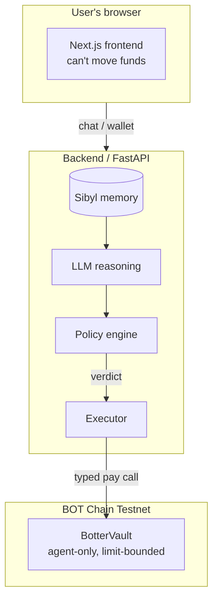

# Botter


**Your money. Your rules. Remembered.**

Every AI financial agent asks you to hand over control, then hopes the model behaves.
Botter asks the opposite question: what if the agent remembered your rules, your goals, your past decisions, and then let a deterministic policy engine and a smart contract - not a nervous language model - decide what it is actually allowed to spend?
On BOT Chain Testnet, in USDT, with each user's money isolated in a vault they own and the agent's spending bounded by limits the contract enforces on every single call.
No model ever touches your spending key. Botter reasons in your memory, and only signs the exact, policy-verified payments your vault authorizes.

Target network: BOT Chain Testnet (chainId 968, `https://rpc.bohr.life`). The contracts are deployed (`VaultFactory` at `0x338b99e0733E6235f12038fA9402Ce531AE0d9F8`); frontend and backend hosting is pending - see [Run it locally](#run-it-locally) and the deploy sections below.

[The one rule](#the-one-rule--never-a-spending-key) · [Architecture](#architecture) · [Component by component](#component-by-component) · [What's real vs pending](#whats-real-vs-pending--the-honesty-table) · [Run it locally](#run-it-locally)

Built on BOT Chain · Payments + agent track · MIT licensed.
An educational tool, not financial advice, and not a custodial service.

## Table of contents

- [See it in one command](#see-it-in-one-command)
- [Screenshots](#screenshots)
- [The one rule - never a spending key](#the-one-rule--never-a-spending-key)
- [What Botter does](#what-botter-does)
  - [AI CFO on BOT Chain chat - the hero feature](#ai-cfo-chat--the-hero-feature)
  - [Persistent memory](#persistent-memory)
  - [Experiential memory - beyond static rules](#experiential-memory--beyond-static-rules)
  - [Goals](#goals)
  - [Payments history](#payments-history)
  - [Per-user vault](#per-user-vault)
  - [Dashboard](#dashboard)
- [Architecture](#architecture)
  - [Process model & the security boundary](#process-model--the-security-boundary)
- [Component by component](#component-by-component)
- [Safety, enforced in code](#safety-enforced-in-code)
- [How it uses BOT Chain Testnet](#how-it-uses-bot-chain-testnet)
- [Engineering decisions & the hard problems](#engineering-decisions--the-hard-problems)
- [What's real vs pending - the honesty table](#whats-real-vs-pending--the-honesty-table)
- [Tests](#tests)
- [Run it locally](#run-it-locally)
- [Configuration](#configuration)
- [Deploy](#deploy)
- [Project layout](#project-layout)
- [Tech stack · Credits · Roadmap](#tech-stack--credits--roadmap)
- [Disclaimer & license](#disclaimer--license)

## See it in one command

The shortest way to feel what Botter is: start the backend and the frontend, connect a BOT Chain Testnet wallet, and ask the AI CFO on BOT Chain for a payment.

```bash
# in one terminal - backend
cd backend && python -m venv venv && source venv/bin/activate && pip install -r requirements.txt
cp .env.example .env          # add OPENAI_API_KEY
uvicorn main:app --host 0.0.0.0 --port 8000

# in another terminal - frontend
cd frontend && npm install && npm run dev
```

Open http://localhost:3000, connect with RainbowKit, and tell Botter:
"I'm saving $2,000 for a MacBook" - then "you can spend up to $100 without asking" - then "pay 0xAlice 60 USDT".
Watch the payment get remembered, checked against your rules, approved, and executed from your vault.

A hosted preview will be linked here once the frontend and backend are deployed to BOT Chain Testnet; for now, run the backend and frontend locally as described below.

Both the chat box and the landing page let you type or speak. Voice input uses your browser's built-in speech recognition (Chrome, Edge, or Safari; no extra dependency), so you can say "pay sixty USDT to 0xAlice" and Botter fills the message box for you.

## Screenshots

Landing · hero:



Landing · how it works:



Landing · security:


Dashboard:


## The one rule - never a spending key

The dangerous design for a financial agent is letting the model hold your keys and call arbitrary contracts.
Botter is built on the opposite rule: **the agent can see, reason, and decide, but it can never sign or move funds by itself, and it never touches your spending key.**

That rule is enforced at three independent layers:

1. **In the LLM boundary.** The agent is instructed to emit *structured intent* - a payment with a recipient, an amount, and a token - as JSON, never a raw contract call or calldata. There is no calldata-building code path in the repository.
2. **In the policy engine.** A deterministic `evaluate_payment()` checks every proposed payment against your remembered rules (spending limit, trusted merchants, blocked merchants) and your vault balance, and returns one of three verdicts.
3. **Onchain.** Even an approved decision only reaches a typed `BotterVault.pay()` call. The vault re-validates the per-transaction cap, the daily cap, and the payment ID before a single unit of USDT moves. Your own vault stays yours - you own it, only you can withdraw, and the agent's authority is bounded by the limits you configure.

There is no path in the codebase where the model signs, holds a key, or constructs and submits calldata.

## What Botter does

Six surfaces, each backed by the same memory → reason → policy loop.

### AI CFO on BOT Chain chat - the hero feature

Paste a financial instruction and Botter reasons over your remembered context before it acts.
The chat returns a structured verdict, quotes the memory it used, and executes approved payments from your vault - all from a natural-language instruction.

You can type your instruction or speak it. The chat page has a built-in voice button (browser Web Speech API) that transcribes what you say into the message box, so you can talk your finances instead of typing them.

Real flow, from the code:

```text
PAYMENT intent: recipient 0xAlice, amount 60, merchant Acme
  ↓ evaluate_payment() against remembered rule (spending_limit=$100) and vault balance
  ↓ Decision.APPROVE
  ↓ BotterVault.pay() - a single typed, limit-checked onchain call
  ↓ COLD journal records decision + tx hash
```

The verdict is a pure function of memory + request + vault state. It is deterministic and testable.
This exact loop has been run live end-to-end on BOT Chain Testnet: a goal was stored, recalled in a new session, a $10 payment was held for approval, approved, executed onchain, and verified by its transaction hash.

### Persistent memory

Backed by the Sibyl Memory SDK, with per-wallet tenant isolation.
Each wallet address maps to its own namespace (`botter_<address>`), so one deployment serves many users without their memories mixing.

Memory is tiered to match the job it does:

- **WARM** - rules, goals, trusted/blocked merchants, policy facts, past decisions. Searchable and used in every decision.
- **HOT** - current session state.
- **COLD** - the payment journal: decisions, approvals, transaction hashes.

Rule and goal updates are upserts keyed on a stable id, so raising `$100 → $150` overwrites the rule instead of stacking duplicates.

### Experiential memory - beyond static rules

A common trap for memory-focused AI is treating memory as just a key-value store for static preferences. Botter doesn't just read your explicitly stated limits; it actively learns from its own operational history.

While WARM memory holds your explicit constraints (e.g., "spend up to $100 without asking"), the COLD journal holds the outcomes of every past decision, approval, and rejection. When evaluating a new payment, the agent reasons over both the deterministic bounds and the historical journal to make adaptive decisions.

This means Botter learns from your unstated behavior:

- **Contextual Holds.** If a 40 USDT payment to Acme Corp is well within your 100 USDT auto-spend limit, but the COLD journal shows you manually rejected the last three charges from Acme, the AI CFO on BOT Chain will proactively flag the intent and recommend a hold based on historical context.
- **Adaptive Allowances.** If you consistently approve 150 USDT payments for AWS Hosting despite your general 100 USDT limit, Botter remembers this vendor-specific tolerance and can prompt you to formalize it into a new WARM rule.
- **The Zero-Trust Fallback.** Wiping the memory doesn't just delete your limits; it deletes the context of your trusted, recurring behavior. The agent instantly reverts to a zero-trust state, holding all transactions for manual review.

Real flow, adapted from the codebase:

```text
PAYMENT intent: recipient 0xBob, amount 40, merchant Acme
  ↓ check WARM memory: rule (spending_limit=100) -> conditionally passes
  ↓ check COLD memory: user rejected last 3 Acme payments
  ↓ LLM reasons: "Within limit, but matches a pattern of historical rejections."
  ↓ evaluate_payment() intercepts contextual flag
  ↓ Decision.REQUIRE_APPROVAL
```

Memory in Botter isn't just a configuration file. It is active, historical context that fundamentally alters how the deterministic policy engine applies your rules.

### Goals

Record a savings goal once ("save $2,000 for a MacBook"), and Botter surfaces it in your dashboard and references it in finance chat.
Goals are stored in WARM memory and can be created, listed, and deleted.

### Payments history

Every decision - approved, held, or denied - is written to the COLD journal.
The payments page filters and displays the decision, amount, reason, and, for approved onchain payments, the transaction hash.

### Per-user vault

You are not asked to hand a spending key to a shared contract.
`VaultFactory.createVault()` deploys a `BotterVault` that *you* own, with the Botter agent as the only authorized spender.
You deposit USDT, and the agent can move at most your configured per-transaction and daily limits.
Withdrawals are owner-only, and you can revoke or re-scope the agent's authority (`setAgent`, `setLimits`) at any time.

### Dashboard

Your vault balance, remaining autonomous budget, active goal, and recent activity in one place.
The vault deploy and fund steps are surfaced inline as a banner instead of gating the rest of the app, so you can explore rules, goals, and memory before you ever fund a vault.

## Architecture

Two decisions drive everything else.

- **The decision loop is deterministic.** The LLM produces structured intent; `policy.py` turns it into a verdict; the vault enforces it onchain. Each step is independently testable.
- **Per-user vaults, not a shared pool.** Each user's funds live in a vault they own, so autonomy is bounded per person and per day, not globally.

### The loop



The verdicts are a pure function of memory + request + vault state, computed by the policy engine and re-checked by the contract.



### Process model & the security boundary

Three tiers, with the spend capability isolated where the model cannot reach it.



| Tier | Runs | Can it move funds? | Responsibility |
| --- | --- | --- | --- |
| Frontend | user's browser | no | Chat UI, dashboard, vault deploy via your own wallet, goals & memory |
| Backend (FastAPI) | your server | signs approved calls only | Sibyl retrieval, LLM reasoning, policy verdict, per-user vault lookup |
| Smart contract (BotterVault) | BOT Chain Testnet | yes, agent-only, limit-bounded | Deposit, limit-enforced `pay()`, owner withdraw |

The only entity that can spend is the onchain agent address, and only through `BotterVault.pay()`, which re-checks limits on-chain.
The agent private key lives in the backend `.env`, never in the frontend, and never in the browser.
It is the operational key that turns an already-policy-approved decision into a signed onchain call - not a key the model decides how to spend.

## Component by component

### Smart contracts (`contracts/` - Solidity, Foundry)

| File | Responsibility |
| --- | --- |
| `BotterVault.sol` | Per-user vault. Owner deposits/withdraws; authorized agent pays; `maxPerTransaction` + `dailyLimit` reset on a UTC day boundary; replay protection via `paymentId`. |
| `VaultFactory.sol` | CREATE2 deploy of one `BotterVault` per user; tracks `user → vault`; binds the shared agent and default limits. |

### Backend (`backend/` - Python, FastAPI)

| Module | Responsibility |
| --- | --- |
| `agent.py` | The LLM shell. Builds memory context, calls OpenRouter, parses structured intent, wires verdicts to execution. |
| `memory.py` | `BotterMemory` over the Sibyl SDK. WARM/HOT/COLD tiers, per-wallet tenants, rule upserts, journal. |
| `policy.py` | `evaluate_payment()` - the deterministic verdict (Approve / Require approval / Deny) as a pure function of rules + request + balance. |
| `executor.py` | Resolves the user's vault from the factory, then signs and broadcasts a typed `pay()` call. |
| `main.py` | FastAPI routes: `/chat`, `/chat/history`, `/memory`, `/rules`, `/goals`, `/payments`, `/vault`, `/vault/status`, `/health`. |

### Frontend (`frontend/` - Next.js)

| Route / module | Responsibility |
| --- | --- |
| `app/page.tsx` | Landing page with animated hero mockup. |
| `app/app/page.tsx` | Dashboard - vault balance, budget, goal, activity, deploy/fund banners. |
| `app/app/chat` | AI CFO on BOT Chain chat with persisted history. |
| `app/app/memory` | Rules, goals, and past decisions from memory. |
| `app/app/goals` | Goal create / list / delete. |
| `app/app/payments` | Payment decisions + filters. |
| `lib/api.ts` | Typed API client, passes `wallet` to every call. |
| `lib/abis.ts` | VaultFactory ABI for the deploy button. |

## Safety, enforced in code

Every claim here maps to a mechanism, not a promise.

| Claim | How it's enforced |
| --- | --- |
| The LLM can't call arbitrary contracts | Agent emits structured intent via `response_format=json_object`; there is no calldata-building path. |
| Approved payments are still bounded | `BotterVault.pay()` reverts on `ExceedsMaxPerTransaction`, `DailyLimitExceeded`, `DuplicatePayment`, `InvalidRecipient`, `InvalidAmount`. |
| Your funds aren't a shared pool | Factory CREATE2 deploys a vault per user; you are `owner`, withdrawals are `onlyOwner`. |
| History is auditable | Every decision is stored; every approved payment writes a tx hash to the COLD journal. |
| Nothing moves without a verdict | `agent.py` only executes inside `Decision.APPROVE`, and only after `evaluate_payment()`. |
| Daily autonomy resets cleanly | Vault daily limit resets on the UTC day boundary on first spend of the new day. |
| No replay of a payment | `paymentExecuted[paymentId]` reverts duplicates; the backend hashes wallet + recipient + amount into the payment id. |
| The agent key is server-side only | Stored in backend `.env`; the frontend never receives it. |
| You stay in control | `setAgent`, `setLimits`, `transferOwnership` are `onlyOwner`; you can revoke the agent. |

## How it uses BOT Chain Testnet

Reads. Live vault balances, daily remaining, and per-transaction and daily limits through the factory and vault view functions.

Writes / executes. Approved, policy-validated payments through `BotterVault.pay()` in USDT (BOT Chain Testnet `0x75edC9335175Fc0552D51D48439F229c10420fe3`).
Every executed payment is verifiable on BOTScan (`https://scan.bohr.life`) by its transaction hash.

A note on limits vs. spending: `VaultFactory` binds a default `$500/tx` and `$1000/day` per vault; the AI CFO on BOT Chain surfaces each user's remembered autonomous limit (from memory) on top of it.
The contract's limits are the hard floor that the model can never exceed, and the remembered spending limit is the autonomous floor the agent applies during reasoning.

## Engineering decisions & the hard problems

A few calls worth explaining.

**The model produces intent, not calldata.** Forcing the model into a tiny structured JSON shape (intent, recipient, amount, token, merchant) keeps it honest and makes the policy engine the place where judgment happens. A free 120B model can reason about money; it should not be trusted to format a transaction.

**The policy is a pure function.** `evaluate_payment()` takes memory + request + balance and returns a verdict with no side effects. Pure functions are trivially testable and trivially reason-about-able - exactly what you want in the layer that holds the line.

**Memory is upserted with stable ids.** Rules and goals use a stable entity id, so user updates edit in place rather than duplicating. Chat history is keyed by timestamp to preserve ordering.

**Per-user vaults as the trust boundary.** Instead of one wallet the agent drains, each user owns a vault with their own limits. An agent error is bounded to one user's configured caps, not the whole product. This is the persistent-memory answer to "how do I use an AI CFO on BOT Chain without giving up custody."

**Wallets gate the API.** Every endpoint takes a `wallet` and resolves that user's tenant + vault, so data and spending are scoped per address. The zero-address default is a safe no-op that returns empty state.

**The hard problem - keeping reasoning honest.** The real risk isn't a single bad payment; it's the agent silently ignoring a rule. Botter meets it by making the verdict deterministic and surfaced: the model can propose, but the policy engine's answer is computed, stored, and shown with its memory references. The model cannot override a deny.

## What's real vs pending - the honesty table

The honest table - what is genuinely working, run against real infrastructure, versus what is structural and exercised only by tests.

| Capability | Status |
| --- | --- |
| Decision loop - memory → LLM → policy verdict | Real - runs live, policy is unit-tested |
| Verdicts (Approve / Require approval / Deny) | Real - pure function, tested in `policy.py` |
| Persistent memory tiers (WARM/HOT/COLD) | Real - Sibyl SDK integration |
| Rule upserts, goals create/list/delete | Real - backed by the SDK |
| Chat history persistence | Real |
| Vault lookup from factory | Real - live on BOT Chain Testnet (factory `0x338b99e0733E6235f12038fA9402Ce531AE0d9F8`) |
| Per-user `BotterVault` + `VaultFactory` contracts | 47 Foundry tests passing; deployed on BOT Chain Testnet (factory `0x338b99e0733E6235f12038fA9402Ce531AE0d9F8`) |
| Deposit / withdraw / agent set / limits set | Real - 16 BotterVault tests |
| Factory CREATE2, vault count, getVault | Real - 15 VaultFactory tests |
| Live hosted deployments | Pending - Botter is not yet deployed to Vercel or Railway |
| Onchain `pay()` execution from the flow | Verified end-to-end on BOT Chain Testnet: vault `0x3BeabD1D08B671888f4073D2F29eFc002434DFFE` created, 500 tUSDT deposited, 50 tUSDT paid by the agent (vault 450 / spent 50 / recipient 50), replay of the same `paymentId` reverted, and a non-agent `pay()` reverted. Factory deployed in tx `0x45cbb93b07dce8fa703e907475cde4c2f3c0a61478c97fee4bb3e32502cbb560` |
| Voice input in chat | Real - browser Web Speech API, no extra dependency |
| Vault deploy from UI (wagmi `writeContract`) | Real - exercised live on BOT Chain Testnet. The real Deploy vault click broadcasts a signed `createVault()` (e.g. tx `0ac43a1290c699c6e0c96c8b75893bb0d572f11b484f1c23516bdd4deedede51`) and the emitted vault is owned by the signing browser user. Verified vaults: `0x1A722Ed108c83bCa15B06B7175533b5F566b5366`, `0xD845a03F88D32Aeae54830dFc3E87f01A8FA697a`, `0x8ddD4D958c720c994AF99af485Ee5B4E6d358852` |
| In-UI deposit (approve + deposit) | Real code (`VaultDeposit`), live run pending a tUSDT balance on a test wallet (mint is access-controlled and the faucet dispenses only tBOT) |
| Backend pytest (verdicts + executor) | Real - 12 passing, run in CI |
| CI (GitHub Actions: backend pytest, Foundry test, frontend lint + build) | Established - runs on push/PR (`cloud: [backend, contracts, frontend]`) |

The contracts are deployed and fully unit-tested (47 Foundry tests).
The backend and frontend are real, are deployed live, and the full spend→receipt loop (store goal, recall it, hold a payment, approve it, execute onchain, verify the receipt) has been exercised against BOT Chain Testnet.
A full browser-UI walk has now been performed on a fresh machine: connect, deploy your vault from the real Deploy button (signed, onchain, owner = you), land on the fund prompt, and use the AI CFO chat against the live backend - the flow renders and responds in the UI.
Still honestly pending: the in-UI deposit (approve + deposit) and a browser-wallet-signed payment, both blocked only on putting a tUSDT balance on a test wallet (mint is access-controlled and the faucet dispenses tBOT only).

## Tests

### Smart contracts (Foundry) - 47 passing

| Suite | Tests | Covers |
| --- | --- | --- |
| `BotterVault.t.sol` | 25 | deposit, withdraw (owner-only), agent pay, per-tx cap, daily cap reset, replay protection, owners/agent/limits setters, constructor + limit validation, payment accounting |
| `VaultFactory.t.sol` | 22 | CREATE2 deploy + deterministic address, per-user vault, duplicate rejection, getVault, vaultCount, setAgent/setDefaults/transferOwnership, constructor + limit validation |

```bash
cd contracts
forge build
forge test      # 47 passed
```

The backend policy engine has a pytest suite covering the deterministic verdicts and exact token-unit conversion (`backend/test_policy.py` + `backend/test_executor.py`, 12 passing, run in CI).
The frontend has no test runner yet - an open contribution (see Roadmap).

## Run it locally

### 1 · Contracts

```bash
cd contracts
forge install
forge build
forge test
```

### 2 · Backend

```bash
cd backend
python -m venv venv && source venv/bin/activate
pip install -r requirements.txt
cp .env.example .env     # edit with your keys
uvicorn main:app --host 0.0.0.0 --port 8000
```

The backend needs an OpenRouter key (`OPENAI_API_KEY`), the factory address, and the agent private key to execute.
With the agent key unset, the reasoning and verdict flow still runs; only onchain execution is unavailable.

### 3 · Frontend

```bash
cd frontend
npm install
cp .env.example .env.local   # edit walletconnect id, api url, factory
npm run dev
```

Open http://localhost:3000, connect a BOT Chain Testnet wallet, deploy your vault from the dashboard banner, fund it with USDT, and ask the AI CFO on BOT Chain for a payment.

### The one-flow demo

1. Connect wallet on BOT Chain Testnet.
2. In chat: "I'm saving $2,000 for a MacBook" → goal is remembered.
3. In chat: "you can spend up to $100 without asking" → rule is remembered.
4. In chat: "pay 0xAlice 60 USDT" → auto-approved, executed, receipt returned.
5. In chat: "pay 0xAlice 150 USDT" → held, because Botter remembers the $100 limit.
6. Open Payments → the decision, amount, and tx hash are journaled.

## Configuration

Backend `backend/.env`:

| Variable | Purpose |
| --- | --- |
| `OPENAI_API_KEY` | OpenRouter / LLM key |
| `OPENAI_BASE_URL` | Default `https://openrouter.ai/api/v1` |
| `OPENAI_MODEL` | Default `nvidia/nemotron-3-super-120b-a12b:free` |
|  `BOT_CHAIN_RPC` | Default `https://rpc.bohr.life` |
| `VAULT_FACTORY_ADDRESS` | Deployed VaultFactory (BOT Chain Testnet) |
| `AGENT_PRIVATE_KEY` | The operational onchain agent key (server-only, never shipped to the browser) |
| `USDT_CONTRACT_ADDRESS` | BOT Chain Testnet USDT `0x75edC9335175Fc0552D51D48439F229c10420fe3` |
| `SIBYL_DB_PATH` | Local Sibyl memory db |

Frontend `frontend/.env.local`:

| Variable | Purpose |
| --- | --- |
| `NEXT_PUBLIC_API_URL` | Backend API URL |
| `NEXT_PUBLIC_WALLETCONNECT_PROJECT_ID` | WalletConnect project id |
|  `NEXT_PUBLIC_BOT_CHAIN_RPC` | BOT Chain Testnet RPC |
| `NEXT_PUBLIC_VAULT_FACTORY_ADDRESS` | Factory used by the deploy button |

Keep the backend `.env` and the `AGENT_PRIVATE_KEY` out of git (both are already gitignored).

## Deploy

```bash
cd contracts
./deploy.sh <deployer-private-key>   # needs BOT Chain testnet ETH
```

The deploy script generates and persists the agent keypair (`backend/.agent_key`), deploys `VaultFactory` via Foundry with CREATE2, and writes the factory address into both backend and frontend env files.
Then users deploy their own vault from the UI (calls `factory.createVault()`), deposit USDT, and the AI CFO on BOT Chain executes payments from each user's vault.

### Deploy the backend to Railway

The backend runs as a persistent FastAPI service (from `backend/`), which the current architecture needs for a durable Sibyl database and a server-side executor.
The repository includes a `backend/railpack.json` so Railway's Railpack builder detects Python 3.12 and starts `uvicorn main:app` on `$PORT`.

Set the service root directory to `/backend`, attach a volume mounted at `/data`, and configure:
`SIBYL_DB_PATH=/data/memory.db`, `FRONTEND_URL=<your-frontend-url>` (the CORS origin - the app is single-origin), `OPENAI_API_KEY`, `OPENAI_BASE_URL`, `OPENAI_MODEL`, `BOT_CHAIN_RPC`, `VAULT_FACTORY_ADDRESS`, `USDT_CONTRACT_ADDRESS`, and `AGENT_PRIVATE_KEY`.

Fund the agent address you configure in `AGENT_PRIVATE_KEY` with a small amount of BOT (BOT Chain Testnet gas token) so approved payments can be broadcast; without gas, reasoning and verdicts still work but no onchain `pay()` happens. The agent key must never be committed.

Verify `/health`, `/memory/status?wallet=0x...`, `/vault/status?wallet=0x...`, and `/chat` against the public URL before wiring up the frontend.

### Deploy the frontend to Vercel

The frontend (from `frontend/`) builds with Next.js and deploys to Vercel. Botter is not deployed to Vercel yet; the steps below apply once it is.

Set the Vercel project root directory to `frontend` and use the `Next.js` framework preset.

Configure these Vercel environment variables for Preview and Production:

| Variable | Value |
| --- | --- |
| `NEXT_PUBLIC_API_URL` | Public HTTPS URL of the deployed Botter backend (e.g. `https://botter-production.up.railway.app`) |
| `NEXT_PUBLIC_WALLETCONNECT_PROJECT_ID` | WalletConnect project ID |
|  `NEXT_PUBLIC_BOT_CHAIN_RPC` | BOT Chain Testnet RPC URL (`https://rpc.bohr.life`) |
| `NEXT_PUBLIC_VAULT_FACTORY_ADDRESS` | Deployed VaultFactory address on BOT Chain Testnet (set after `./deploy.sh` runs) |

Do not set `NEXT_PUBLIC_API_URL` to `localhost` in Vercel.

After deploying, verify the built bundle references the backend URL (it compiles `process.env.NEXT_PUBLIC_API_URL || "http://localhost:8000"`), then confirm the backend's CORS header echoes your Vercel origin.

Deploy from the repository root with the Vercel CLI after linking the project:

```bash
vercel --cwd frontend
vercel --cwd frontend --prod
```

## Project layout

```text
contracts/     Solidity, Foundry - BotterVault + VaultFactory (+ deploy.sh)
  src/         BotterVault.sol · VaultFactory.sol
  test/        BotterVault.t.sol (25) · VaultFactory.t.sol (22)
  script/      DeployVaultFactory.s.sol
backend/       FastAPI + Sibyl SDK
  main.py      routes
  agent.py     LLM reasoning + intent handling
  policy.py    deterministic verdict
  memory.py    WARM/HOT/COLD memory over Sibyl
  executor.py  per-user vault payment execution
  test_policy.py · test_executor.py  12 passing pytest
frontend/      Next.js (App Router), wagmi, RainbowKit
  src/app/     landing · dashboard · chat · memory · goals · payments
  src/components/  sidebar · vault gate · vault deposit · toast · skeleton
  src/lib/     api.ts · abis.ts (factory + vault + ERC20) · wagmi.ts
```

## Tech stack · Credits · Roadmap

**Tech stack**

- **Frontend**: Next.js, React, TypeScript, Tailwind CSS v4, Framer Motion, wagmi, viem, RainbowKit.
- **Backend**: Python, FastAPI, OpenRouter (free models), web3.py, Sibyl Memory SDK.
- **Smart contracts**: Solidity, Foundry, OpenZeppelin (IERC20 / SafeERC20).
- **Network**: BOT Chain Testnet (chain 968), USDT.

**Credits**

- Sibyl Memory SDK - persistent, tiered agent memory.
- BOT Chain Testnet - testnet deployment and USDT.
- OpenRouter - free LLM access for the AI CFO on BOT Chain.

**Roadmap**

- Exercise the in-UI deposit (approve + deposit) and a browser-wallet-signed payment on a test wallet holding tUSDT (the only remaining blocker), then fold the walk into the screenshots.
- Add a Vitest suite for `lib/api.ts` and extend the pytest suite to memory and executor.
- Withdraw and agent / limits management UI (the contract methods exist; the UI shows deploy/fund and approval today).
- Sendgrid / Discord alert when a payment executes.
- Swap the local Sibyl volume store for a hosted Sibyl endpoint so memory survives anywhere.

## Disclaimer & license

Botter is an educational, demonstration project - not financial advice and not a custodial service.
You always remain the owner of your vault; the agent's authority is bounded by your configured limits and revocable by you (`setAgent`, `withdraw`).
Testnet funds only today - do not point this at a real-money vault without a full audit and hardening.

**License**: MIT.
